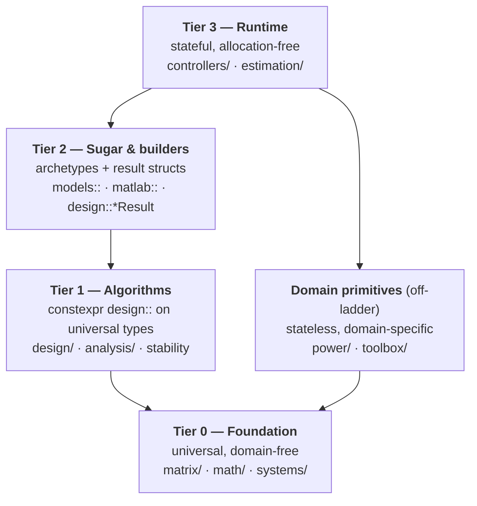

# Tier layering

Tiers 0–3 measure position on the **synthesis pipeline**: universal plant →
algorithm → result → deployed loop. The axis is *"how far along the
design-to-runtime path is this?"* — Tier 0 is the vocabulary everything is
written in, Tier 3 is the stateful loop you flash to the target. Grounds out of
[decisions.md] D2 (universal types) and D3 (three-tier synthesis pattern).

**Tier 0 is universal and domain-free** — a `Matrix`, a `StateSpace`, a
quaternion mean the same thing for a motor, a thermal loop, or a robot arm.
Code that carries *domain* knowledge but no plant model — Clarke/Park (only
meaningful for three-phase), SVPWM (only for converters), an NTC curve, encoder
decode — is stateless like Tier 0 but **not** Tier 0. Those are **domain
primitives**: off the synthesis ladder, callable by any tier, standing on Tier
0 themselves.

| Tier | What it is | Test | Lives in | Examples |
|------|-----------|------|----------|----------|
| **0 — Foundation** | Universal, domain-free types & math. The vocabulary every other tier is written in. | Means the same for *any* plant | `matrix/`, `math/` (incl. `geometry`), `systems/` | `Matrix`, `StateSpace`, `TransferFunction`, `Quaternion` |
| **1 — Algorithms** | `constexpr` `design::` functions that see only the universal type and hold all the math, once. | Takes an `A,B,C,D`, knows no domain | `design/`, `analysis/`, `design/stability.hpp` | `design::discrete_lqr`, `place`, `current_loop_gains`, `analysis::bode` |
| **2 — Sugar & builders** | Archetype builders (named params → universal type → Tier 1 → named result) and `Result{ .as<U>(), success }` structs. Computes nothing new. | Removing it leaves the library complete | `models::` (planned), `matlab::`, `design::*Result` | `models::two_mass`, `matlab::dlqr`, `LQRResult` |
| **3 — Runtime** | Allocation-free stateful objects you deploy: `step()`/`control()`, anti-windup, reset. | Owns a loop, holds state | `controllers/`, `estimation/` | `PID`, `LQR`, `FOController`, `Kalman` |
| **— Domain primitives** | Stateless helpers carrying domain knowledge but no plant model. Off the synthesis ladder; any tier may call them. | Stateless, but domain-specific | `power/`, `toolbox/` | Clarke/Park, SVPWM, `AffineCal`, `OnDelayTimer`, NTC curve, encoder decode |

Leaf utilities (`scaling`, `lookup`, timers, logic) are domain primitives too —
pure runtime blocks with no plant model, so they deliberately skip the
synthesis pattern (decisions.md D3) rather than threading 1→2→3.

## Worked example: FOC

One feature, spread across the layers it belongs to:

| Piece | Layer | Home |
|-------|-------|------|
| Clarke/Park transforms, SVPWM | Domain primitive | `power/transforms.hpp`, `power/modulation.hpp` |
| `design::current_loop_gains`, `iq_from_torque`, `voltage_circle_radius` | Tier 1 | `design/foc_design.hpp` |
| `FocResult`, `DqCommand` (design/runtime hand-off structs) | Tier 2 | with the controller |
| `FOController` (dq PI loops, anti-windup, bumpless disable, `step()`) | Tier 3 | `controllers/foc.hpp` |

[decisions.md]: decisions.md
